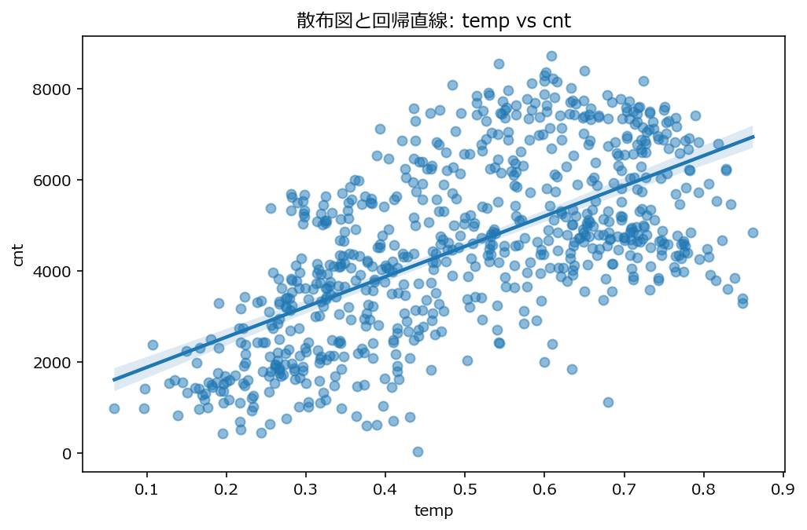

# Bike Sharing Linear Regression

Bike Sharing データを用いて、**気温 (`temp`) が自転車利用者数 (`cnt`) に与える影響**を回帰分析で検証したプロジェクトです。  
就活用ポートフォリオとして、**単回帰モデルの構築・可視化・残差診断・モデル比較**まで一通り実施しました。

最終的には、単純な一次の単回帰 `cnt ~ temp` だけでなく、**2次項を加えたモデル `cnt ~ temp + temp^2`** も比較し、データへの当てはまりを評価しています。

---

## プロジェクト概要

この分析では、Bike Sharing データの日次データを用いて、利用者数 `cnt` を目的変数、気温 `temp` を説明変数として回帰分析を行いました。

分析の流れは次の通りです。

1. データの確認（欠損値・型・変数の整理）
2. 基本集計と可視化
3. 単回帰モデル `cnt ~ temp` の構築
4. 残差診断
5. 2次項を加えたモデルとの比較
6. AIC・Q-Q plot・Scale-Location Plot による評価
7. 結論の整理

---

## 使用データ

- **データ名**: Bike Sharing Dataset
- **使用ファイル**: `data/day.csv`
- **目的変数**: `cnt`（1日あたりの総利用者数）
- **主な説明変数候補**:
  - `temp`（気温）
  - `hum`（湿度）
  - `windspeed`（風速）

本分析では、まずは **気温と利用者数の関係に注目**し、単回帰モデルを構築しました。

---

## 分析のポイント

### 1. 基本集計・可視化

可視化と基本集計から、以下の傾向を確認しました。

- 季節別の平均や箱ひげ図を見ると、**利用者数は夏に高く、冬に低い傾向**がみられた
- このことから、**気温が高い時期ほど利用者数が増える可能性**があると考えられる
- 散布図では、**気温と利用者数の間に正の相関**が示唆された
- 一方で、**湿度や風速と利用者数の間には負の相関傾向**がみられた

相関ヒートマップでも、気温と利用者数の正の相関が確認され、まずは `temp` を用いた単回帰分析を行う方針としました。

---

### 2. 単回帰モデル `cnt ~ temp`

`cnt ~ temp` の単回帰モデルを構築した結果、以下の値が得られました。

- `temp` の係数: **6640.710**
- p値: **2.811e-81**
- 決定係数 \( R^2 \): **0.394**
- 調整済み決定係数: **0.393**

#### 解釈
- `temp` の係数が正であることから、**気温が上がると利用者数が増加する傾向**がある
- p値が非常に小さいことから、**気温は利用者数に対して統計的に有意な説明変数**である
- 一方で、調整済み決定係数は 0.393 であり、**気温だけでは利用者数の約40%しか説明できない**
- つまり、**残りの約60%は他の要因によって説明される可能性**がある

---

### 3. 残差診断

単回帰モデルの残差プロットを確認すると、LOWESS 線がやや**山なりに曲がる**傾向が見られました。


#### 解釈
- 大きな破綻があるとは言えない
- ただし、**単純な直線関係だけでは捉えきれていない可能性**がある
- そのため、`temp` と `cnt` の関係は一次式だけでなく、**曲線的な関係**を含む可能性があると考えた

この結果を受けて、2次項を加えたモデルを検討しました。

---

### 4. 2次項を加えたモデル `cnt ~ temp + temp^2`

2次項を加えたモデルを構築した結果、以下の値が得られました。

- `temp` の係数: **21406.931**
- `temp^2` の係数: **-15055.025**
- `temp` の p値: **1.548e-33**
- `temp^2` の p値: **4.569e-18**
- 決定係数 \( R^2 \): **0.453**
- 調整済み決定係数: **0.452**

#### 解釈
- `temp^2` の係数が負であることから、**気温が上がるほど利用者数は増えるが、その増え方は次第に緩やかになる可能性**が示唆される
- 調整済み決定係数は **0.393 → 0.452** に上昇しており、**一次モデルよりも2次項ありモデルの方がデータをよく説明している**

また、残差プロットでは、2次項を加えることで **LOWESS 線がより 0 付近に近づき**、一次モデルで見られた山なりの傾向が弱まりました。  
このことから、`temp` と `cnt` の関係は、**一次式だけでなく2次の関係も考慮した方が適切**である可能性があります。

---

### 5. AIC によるモデル比較

AIC による比較結果は次の通りです。

- Nullモデル: **13141.373**
- `cnt ~ temp`: **12777.536**
- `cnt ~ temp + temp^2`: **12704.116**

#### 解釈
- AIC は小さいほど良いため、**`cnt ~ temp + temp^2` が最も適切**
- 特に、`cnt ~ temp` からさらに **約73低下**しており、**温度と利用者数の関係を直線だけでなく曲線で表す意義が大きい**ことが示唆される

---

### 6. Q-Q plot と Scale-Location Plot

#### Q-Q plot
Q-Q plot を確認すると、**2次項を入れたモデルの方が点が正規直線の周辺により集まっている**ことが分かりました。  
差は大きくないものの、**残差の正規性という点では2次項ありモデルの方がわずかに良い**と考えられます。

#### Scale-Location Plot
Scale-Location Plot を確認すると、2次項を組み込んだモデルでは **LOWESS 線の傾きがやや大きく**なっていました。  
一方で、図全体を見る限り、**y軸方向の点の散らばりは一次モデルと大きくは変わらない**ため、**等分散性が明確に改善したとは言いにくい**です。

---

## 結論

以上の分析から、**AIC・残差プロット・Q-Q plot を総合的にみて、最終的には `cnt ~ temp + temp^2` を採用**しました。

特に、以下を重視しています。

- 単回帰 `cnt ~ temp` でも、気温が利用者数に与える影響を有意に説明できた
- ただし残差には曲線的な傾向が残っていた
- 2次項を追加すると、その傾向が弱まり、AIC も改善した
- Q-Q plot でも、2次項ありモデルの方がわずかに良い結果を示した

そのため、本分析では  
**「気温は利用者数を説明する重要な変数であり、その関係は単純な直線ではなく、やや曲線的である可能性が高い」**  
という結論に至りました。

---

## 今後の課題

今後は、気温だけでなく以下の変数も加えた分析を行うことで、より精度の高いモデル構築を目指します。

- `hum`（湿度）
- `windspeed`（風速）
- `season`（季節）
- `weathersit`（天候）
- `workingday`（勤務日かどうか）

つまり、次のステップとしては、**重回帰分析によって利用者数の変動をより多面的に説明すること**が課題です。

---

## ファイル構成

```text
bike-sharing-linear-regression/
│
├── README.md              ← プロジェクト概要
├── requirements.txt       ← 実行環境
│
├── data/
│   └── day.csv            ← 元データ
│
├── notebooks/
│   └── analysis.ipynb     ← 分析ノート（可視化・検証）
│
├── src/
│   └── model.py           ← 回帰モデルのコード（整理版）
│
├── results/
│   ├── residual_plot.png
│   ├── qq_plot.png
│   └── scale_location.png
│
└── report/
    └── summary.md         ← 結論まとめ
